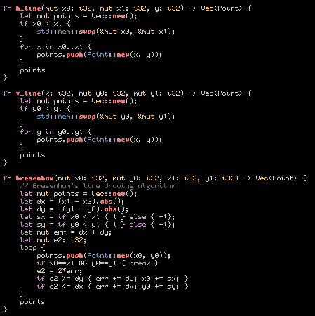
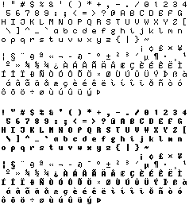

Title: Making Stuff For Its Own Sake 
Date: 2020-08-12
Author: Ivy Sly
Slug: making-stuff
Summary: Showing off a font and a little toy. Some thoughts about the process of making stuff and why we (or at least I) do it.

Anyone who bears the misfortune of both knowing me and having an open private messaging inbox knows I've been keeping myself very busy during the quarantine with projects on my computer. 

Most important is the almost-finished music album I've poured an absolute boatload of time into since March. However, as much as it hurts to keep quiet about it, I want to make sure everything is perfect before I release, and it would just be bad form to get into its guts before the cement has cured. If you're here because you're a fan of my music, just know that it's coming out this year, and probably soon<a href="#fn1", id="ref1">[1]</a>. 

The next focus after setting that monster of a project aside and beginning an extended break was writing this website. Inspired by an [e-friend](https://snufk.in), I copped his style just a little bit in my approach. Before July, I had no interest or knowledge of really any web-related domains, including html/css (you can tell if you look at the source), but I decided, bullheadedly, that not only would I learn just enough to get something done, but I'd also set up hosting myself on a VPS and scuffle with the DNS instead of just letting some web hosting service accomplish exactly the same thing for a marginal premium. 

Alongside these projects was a dream journal that has since fallen off (I'm planning another writeup on this), running through the Haskell book & all its exercises (which I nearly finished then promptly dropped), then the last blog. Now the focus is these next two projects I'll go into shortly. 

But before I continue, understand that I'm not simply writing this article to toot my own horn, to say, *"Look at me! Look at what I did!"*. That's a part of it, of course, but consider this blog post to be my exploration of what it means to "make things", and a personal effort to try to understand myself in why I feel so constantly compelled to do it. 

I think that many people, including myself, are not honest with themselves about their motivations behind creating. Or, maybe, they simply don't care as much as I do about the meta aspect of it all, which, frankly, probably helps with the whole "actually making things" aspect. But, aha, is this article not just another excuse for me to create something?

Anyway, we must bite into the meat before we start chewing on the bones.

---

## viii

I am currently writing this post in my text editor with a 8pt bitmap font called [viii](https://github.com/uzkbwza/viii) that I created. Being as there's often nothing other than text on my screen, I find there is really something fulfilling about having everything on it be something I've personally *made*.  

This was a satisfying little art project for me, and pragmatically a good way of squeezing some real estate out of my claustrophobic, low-dpi laptop screen. I don't really know the first thing about typography, but with such a limited space to draw points for each glyph, it starts to feel more like a meditation or puzzle than a rigorous artform. Most characters are 5x7 with an ascent and descent of 2 pixels each (I think?). Many times, especially with the bold characters, the difference between legible and not was a matter of changing one pixel. 

The full set of characters in viii

    

I won't lie and say I didn't often look at [other fonts](https://github.com/Tecate/bitmap-fonts) for guidance, 'cause I did, but I did always try to figure things out on my own first, and to take the design in a unique direction. I took from my own handwriting some quirks—for example, note the somewhat unusual finials<a href="#fn2", id="ref2">[2]</a> that bend forward under some glyphs ('i', 'l', 't', and 'T'). That may have something to do with some nature of my left-handedness. Or maybe I just want to feel special. 

Others I can't justify so easily, like the odds and ends on the characters "Z", "L", "E", "J", emboldened "Y", and so on—I just thought they looked interesting, and wanted to lay on some personality, and try to use this medium as a form of expression as much as possible. That's what matters, right? Legibility and cool-lookingness. Sometimes one might only even consider the aesthetics important, function be damned. In fact, earlier iterations of viii (vii? vi?) were a lot more individually flavorful, but I wanted to make some concessions for readability and neutrality. What you see in these images is the toned-down version I'm now using for my everyday computer routine. Though, really, I made viii for *my own* personal use, and it's maybe not quite meant to be the most readable.

Now, my own viii is similar to and occasionally identical with another 8pt bitmap font called [Tewi](https://github.com/lucy/tewi-font), which I was using myself beforehand. And, I mean, just look at it! It's pretty and clean. Tewi also has way more characters than mine, and I'm even using it as a fallback in case I encounter any characters not covered in the ISO 8859-1 series. Practically speaking, I had no reason to make a font myself. 

But these things are rarely practical, aren't they? I mean, sure, the smaller size of mine and Lucy's font are useful on smaller screens, but there are dozens or hundreds or thousands of tiny bitmap fonts alike that predate either of ours. I don't know what Lucy's reasoning for making her font may have been, but for me, I feel some kind of a deeper intimacy with my writing environment now, the way a craftsman who crafts their own tools might draw deeper inspiration from them (perhaps despite their tools' relative imperfections).

---

## My Bonsai World

After making viii, I wanted a project I could actually use it with. I spent a few days thinking about what to do, and I remembered a [falling sand game](https://maxbittker.com/making-sandspiel) someone had made in Rust, a programming language I like to use. I heavily based my code on Sandspiel's architecture, though it's a lot messier, and I still have some major issues I've yet to figure out before putting it online. 

<video style="max-width:100%" controls>
<source src="videos/sand2.webm">
</video>

But the code itself isn't really my focus here anyway. A project like this is very visceral, and most of my time spent "developing" has been just playing with the mechanics in-game and deciding whether or not they could "feel better". I understand my approach here is different (and more time consuming) than most peoples' in the same situation, but it mirrors the way I make music as well. Simply put, I've probably spent more time listening to my own music than actually making it. While that might sound like a failure in productivity on my part, doesn't it also sound like the end goal? I make the music I want to hear. I make the falling sand powder game I want to play. 

When I went back to play some older powder games to pick apart their mechanics, I honestly felt a little depressed. What used to be a harmless, fun activity is now a reference I have to square up to. When before I could just toy with the game and explore it curiously, I am now intimidated by the breadth of mechanics, and I feel pressured to understand how they work internally. It's not fun anymore unless it's my own—I've unknowingly sent myself to "no-fun" jail because I had the urge, once again, to do everything *my own way*.

At a certain point, I feel like the drive to "do it myself" is a self-defeating mindset. I've always been sort of frustrated with this. Often I listen to some music I like, or play some game, or watch some movie, or read some book, and this demon creeps up behind me and says, *Don't you think you should make something like this too? Why don't you do that now? Why are you wasting your time consuming what someone else made, when you could make something you'd like more?*

This is, on one hand, a great motivator for creativity. But there is a serious tradeoff: that of taste. I said I listen to my own music more often than I make it, but allow me generalize this statement even further—**I listen to my own music more than I listen to any others'.** This is not entirely out of narcissism. I listen to my own music because it is more *comfortable* than finding something new, or hearing something I did not notice in a song I'm already familiar with. I know my own music so well that I can predict every little thing that happens and I know exactly which parts I like and which songs I don't like so much anymore. Perhaps that is related to my autism? It's very hard for me to leave my comfort zone in most areas (which is why I try to do it as much as possible).

---

## The Common Ancestor 

So I barely listen to music, I barely play games, and I barely consume any other art. But this is a catch-22, because it's imperative that an artist has taste. Without it, I am often lost, and while I think it can contribute to my unique voice, I am constantly spending much more time to accomplish something another artist can do with ease. It is not sustainable to work at 150% like this all the time, and is probably a big reason why I can't seem to pick up any long-term projects. Only if I am waking up and working on one thing until I go back to sleep can I seem to stick with anything. This is not productive, it's just self-harm. 

In the Western canon, it seems that God (or some Gods or other) is the inspiration for most great artists. Things start to go fuzzy when you look at the past 100 years or so, of course. Picasso basically came out the womb painting. Even Steve Reich came from a musical family. Iannis Xenakis is an interesting case to me, being inspired by the ostensibly non-musical domains of architecture and mathematics, but ultimately I cannot find the missing link that brought him there in the first place. 

What is this thing that some people grab ahold of and others don't? No matter someone's citation for their creative inspiration, ultimately, one must put one's pencil on the paper and write their story. No matter how committed Bach was to God, there is something that happens in-between the divine inspiration and actually *manifesting it*. What trauma leads to art? None do, but what is it that trauma leads to which in turn leads to art?

Bottom line, I haven't been able to adequately answer this question: why do we make things? If you don't, why don't you? 

And am I doing it for the wrong reasons? If I did not receive validation from others, would I still be doing it? Does this make me normal for an artist, or am I unusual in this way?

Suppose I was on my own, on a desert island, with no hope of rescue? Assuming I still had free reign to a laptop (somehow), would I still make a font, or a song, or a game, or a blog post? I'd like to think it would help with the loneliness, but thus far I can't think of something I've made that I have both loved and kept only to myself.

---

<a href="#ref1", id="fn1">[1]</a>
One of the major points I need to check off is the art for the album cover and possibly a logo design. If you're a good artist or you know someone who is, I'd be happy to talk about rates. [Shoot me an email](mailto:ivysly@protonmail.com) and I'll get back to you asap.

<a href="#ref2", id="fn2">[2]</a>
I had to [look](https://typedecon.com/blogs/type-glossary/finial) that one up. I'm still not sure if I'm using it right.

